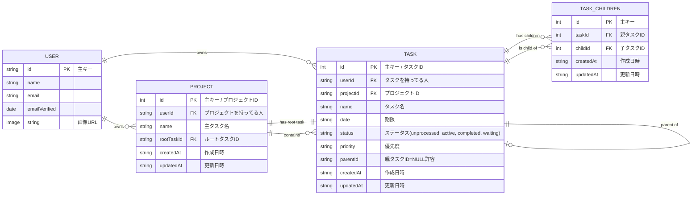

```mermaid
erDiagram
    %% 方向（省略可）
    direction LR

    %% エンティティ定義
    USER {
        string id PK "主キー"
        string name
        string email
        date emailVerified
        image string "画像URL"
    }

    PROJECT {
        int id PK "主キー / プロジェクトID"
        string userId FK "プロジェクトを持ってる人"
        string name "主タスク名"
        string rootTaskId FK "ルートタスクID"
        string createdAt "作成日時"
        string updatedAt "更新日時"
    }

    TASK {
        int id PK "主キー / タスクID"
        string userId FK "タスクを持ってる人"
        string projectId FK "プロジェクトID"
        string name "タスク名"
        string date "期限"
        string status "ステータス(unprocessed, active, completed, waiting)"
        string priority "優先度"
        string parentId "親タスクID=NULL許容"
        string createdAt "作成日時"
        string updatedAt "更新日時"
    }

    TASK_CHILDREN {
        int id PK "主キー"
        int taskId FK "親タスクID"
        int childId FK "子タスクID"
        string createdAt "作成日時"
        string updatedAt "更新日時"
    }

    %% 関連（左←→右のカーディナリティ, ラベル）
    USER ||--o{ PROJECT : "owns"
    USER ||--o{ TASK : "owns"
    PROJECT ||--|| TASK : "has root task"
    PROJECT ||--o{ TASK : "contains"
    TASK ||--o{ TASK_CHILDREN : "has children"
    TASK ||--o{ TASK_CHILDREN : "is child of"
    TASK ||--o| TASK : "parent of"
```
